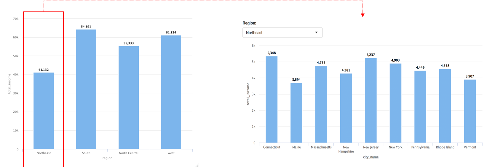

Drill_down을 활용한 효율적인 업무화
========================================================
author: 
date: 
autosize: true

========================================================

Shiny의 기능은 이제 누구나 편하다는것을 알고있습니다.
하지만, 해당 기능을 구현하기위해선 많은 시행착오가 필요하며, 디테일한 부분까지 신경쓰려면 시간의 공수가 많이 들기 마련이죠.

========================================================

그래서 각 옵션에 설정에 따라 시간이 많이 들고, 그에따른 정신 & 체력의 피로도 또한 증가하기 마련입니다.

========================================================

예를 들면 이런거 말이죠.

- 데이터는 지역별 수입을 나타낸 그래프입니다.
- 해당 지역별 상세한 지역별 수익도 보고 싶다고 가정을한다면, shiny의 selectInput으로 선택을 해서 설정해줘야합니다.

========================================================

생각을 해보면... 굳이 한개의 그래프를 여러개로 나눠서 보여줄 의미도 있겠지만, 시간의 공수를 더 줄일 수 있는 방법이 없을까... 고민을 하게되는데요..

========================================================

그래서 생각을 해봤더니, Highchart의 drill_down기능을 활용하면 좋다는점!

========================================================

========================================================

해당 기능을 활용하면 shiny의 차트영역을 줄일 수 있음과 동시에, 효율적인 업무를 증대시킬 수 있습니다.

